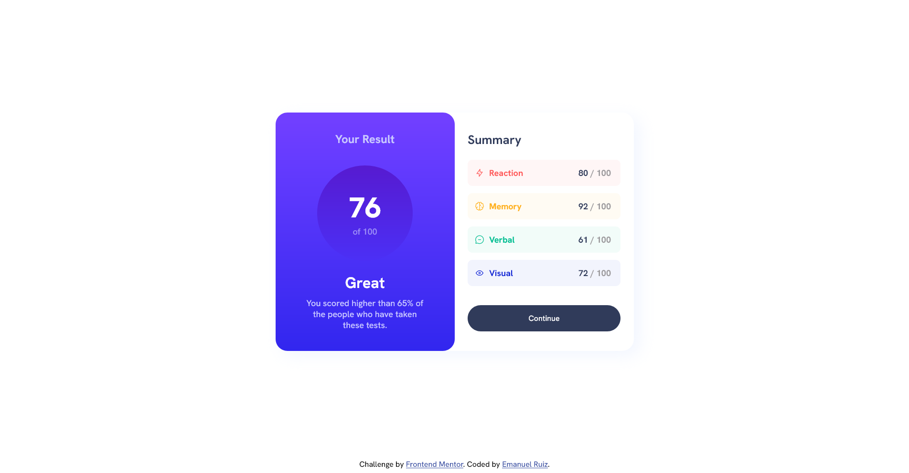

# Frontend Mentor - Results summary component solution

This is a solution to the [Results summary component challenge on Frontend Mentor](https://www.frontendmentor.io/challenges/results-summary-component-CE_K6s0maV). Frontend Mentor challenges help you improve your coding skills by building realistic projects. 

## Table of contents

- [Overview](#overview)
  - [The challenge](#the-challenge)
  - [Screenshot](#screenshot)
  - [Links](#links)
- [My process](#my-process)
  - [Built with](#built-with)
  - [What I learned](#what-i-learned)
  - [Useful resources](#useful-resources)
- [Author](#author)

**Note: Delete this note and update the table of contents based on what sections you keep.**

## Overview

### The challenge

Users should be able to:

- View the optimal layout for the interface depending on their device's screen size
- See hover and focus states for all interactive elements on the page

### Screenshot



### Links

- Solution URL: [Github](https://github.com/ruizemanuel/results-summary-FrontendMentor)
- Live Site URL: [Solution on Netlify](https://enchanting-tapioca-6b08c1.netlify.app)

## My process

### Built with

- Semantic HTML5 markup
- CSS custom properties
- Flexbox
- Mobile-first workflow

### What I learned

Featured code sections:


```css
.gradient-card {
        height: 100%;
        width: 100%;
        border-radius: 0 0 25px 25px;
        display: flex;
        flex-direction: column;
        align-items: center;
        background: -webkit-linear-gradient(bottom, rgb(50, 39, 239) 0%, rgb(102, 60, 255) 80%, rgb(115, 64, 255) 100%);
        background: -o-linear-gradient(bottom, rgb(50, 39, 239) 0%, rgb(102, 60, 255) 80%, rgb(115, 64, 255) 100%);
        background: -ms-linear-gradient(bottom, rgb(50, 39, 239) 0%, rgb(102, 60, 255) 80%, rgb(115, 64, 255) 100%);
        background: -moz-linear-gradient(bottom, rgb(50, 39, 239) 0%, rgb(102, 60, 255) 80%, rgb(115, 64, 255) 100%);
        background: linear-gradient(to top, rgb(50, 39, 239) 0%, rgb(102, 60, 255) 80%, rgb(115, 64, 255) 100%);
    }

.card {
        height: 500px;
        width: 750px;
        border-radius: 25px;
        display: flex;
        box-shadow: 13px 10px 32px 0px hsla(221, 100%, 96%, 0.65);
        -webkit-box-shadow: 13px 10px 32px 0px hsla(221, 100%, 96%, 0.65);
        -moz-box-shadow: 13px 10px 32px 0px hsla(221, 100%, 96%, 0.65);
    }
```

### Useful resources

- [gradientfinder](http://gradientfinder.com/) - This helped me to find the right gradient taking an image as starting point.
- [box-shadow-css-generator](https://cssgenerator.org/box-shadow-css-generator.html) - This is a great tool to generate a box shadow

## Author
- Frontend Mentor - [@ruizemanuel](https://www.frontendmentor.io/profile/ruizemanuel)


